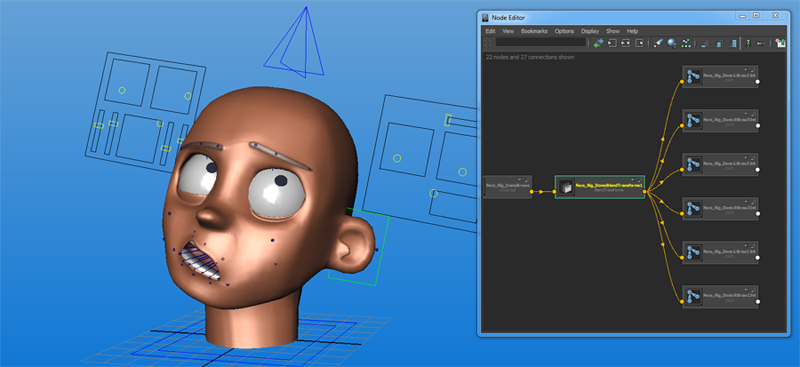

# Blend Transforms - Maya Plug-in

#Introduction

This is a Maya plug-in I've recently put together. Primarily I had facial rigging in mind when developing it.

The idea is to allow users animate joint based rigs in much the same way that they do on blend shape based setups, using attributes to blend poses together rather than controlling joints directly in some fashion. I like doing facial rigs like this as you benefit from the speed and re-usability of a joint based setup but still maintain the nice layer of abstraction that you get from blend-shapes.

At the moment there are only builds (and build scripts) for Windows. There's nothing fancy going on so I think it would be easy to make it work on Mac and Linux.

#Clone

To download the repository using git bash use this command.

    git clone https://github.com/duncanskertchly/blendtransforms.git
    
If you're not interested in the code and just want to use the plug-in it might be easier to use the little green download button on the main project page to download it all as a zip file.

#Binary Installation

##Note
Maya versions lower that 2014 don't come bundled with PyQt so you'll have to install that yourself. This is a bit of a pain as you need to obtain a PyQt4 build that works with the Maya Python interpreter (2.6 or maybe 2.7) which is quite hard to find pre-built versions of. If you really need to use this on 2013 let me know and I'll try and help.

##Installing

At the moment there are builds for Maya 2013 and 2015 in the __Install__ folder. From the relevant version directory copy 

> \install\\\<Maya Version\>\plug-ins\BlendTransforms.mll

to one of your Maya plug-ins folders. Usually something like either of these

> C:\Users\\\<User\>\Documents\maya\\\<Maya Version\>\plug-ins

> C:\Program Files\Autodesk\\\<Maya Version\>\bin\plug-ins

Then copy the scripts from

> \install\\\<Maya Version\>\scripts\

to one of your Maya scripts folders. Usually something like either of these

> C:\Users\\\<User\>\Documents\maya\\\<Maya Version\>\scripts

> C:\Users\\\<User\>\Documents\maya\scripts

Lastly, copy the icons and shelves from

> \install\\\<Maya Version\>\prefs\

in to your Maya prefs directory. This is normally something like

> C:\Users\\\<User\>\Documents\maya\\\<Maya Version\>\prefs

For this step you should preserve the folder structure. So ultimately you'll end up with this file

> C:\Users\\\<User\>\Documents\maya\\\<Maya Version\>\prefs\shelves\shelf_BlendTransforms.mel

and this folder of bitmaps

> C:\Users\\\<User\>\Documents\maya\\\<Maya Version\>\prefs\icons\BlendTransforms

If everything worked correctly when you re-boot Maya you should see a shelf named __BlendTransforms__. Hit the  button and as long as you get no errors everything has worked.

If you want everything to load when you boot Maya just add the line

> BlendTransforms();

to the end of your __userSetup.mel__ file which can normally be found somewhere like

> C:\Users\\\<User\>\Documents\maya\\\<Maya Version\>\scripts\userSetup.mel

#Building From Source

See the following

[Building the plug-in](./BUILDING.md)

#How To Use

See the following

[Using the plug-in](./USING.md)

