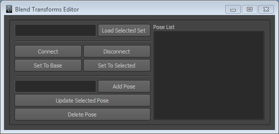

# Using the Plug-in

Before you start make sure everything is loaded properly. To do this manually, select the __BlendTransforms__ shelf and hit the  button. This will load the plugins and source all the relevant scripts. As I've mentioned in the [readme](./README.md) document if you plan to use these tools regularly it would be a good idea to add a line to your __userSetup.mel__ file so they load automatically when you start Maya.

Here are the basic steps you'll need to follow.

1. First make sure the joints you want to use do not have any incoming connectiosn to their translate, rotate or scale attributes and that these attributes are unlocked. Also make sure their rotation order is set to __XYZ__. This is the only rotation order that will work currently.
2. Select the joints that you want to create a setup for. With them selected create a __Set__ by going __Create >> Sets >> Set (Option Box)__. Give the Set a sensible name.
3. In the outliner select the newly created Set and on the __BlendTransforms__ shelf hit the  button. If all goes to plan you should see a message like this in your script editor.
    
        Success!
        # Result: True # 
4. You can now create poses for this set of bones. Open the editor by hitting the  button. The editor should appear which looks like this.

    

5. With your Set still selected hit the __Load Selected Set__ button. The set name should appear in the field to the left.
6. Hit __Disconnect__. You are now ready to create poses. You will need to __Disconnect__ every time you want to add, edit or delete poses. Warnings like this

        # Warning: Disconnect setup first! # 

    will be printed  if you try and do an action the requires disconnection so keep an eye on the script editor.
7. Translate, rotate and scale your joints to create a pose. When you're ready type a (unique) name for this pose in to the lower of the text fields and hit the __Add Pose__ button.
8. Now set the joints back to their initial position by hitting __Set To Base__. From here you can create another pose and add it in the same way as step 7. If you want to edit a pose you've already created, select it in the __Pose List__ and hit __Set To Selected__. The bones will adopt the selected pose. Do your edits and when you're ready hit __Update Selected Pose__. Deleting poses works the same way, select the pose in the list and hit __Delete Pose__.
9. When you have added all the poses you need hit __Connect__.
10. Select your Set and in the channel box you should have a list of attributes you can blend together. In the attribute editor the sliders should appear under the __Extra Attributes__ rollout.
11. Continue addings sets and poses until you have everything you need for your rig.

Once you have a all the Sets and poses you need you can connect some kind of control rig to the attributes that should now exist on the Sets. For simple rigs you could animate the attributes directly.
